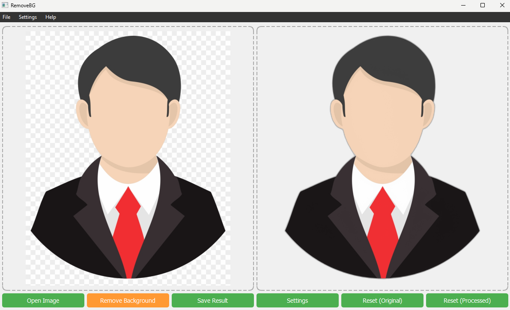

<div align="center">

# Photo Background Remover

**A modern desktop GUI for removing image backgrounds locally with Python, PyQt5, and rembg.**

[](LICENSE)
[](https://www.python.org/)
[](https://pypi.org/project/PyQt5/)
[](https://pypi.org/project/rembg/)

[](https://github.com/rudra-mondal/photo-background-remover/stargazers)
[](https://github.com/rudra-mondal/photo-background-remover/forks)
[](https://github.com/rudra-mondal/photo-background-remover/issues)
[](https://github.com/rudra-mondal/photo-background-remover/pulls)
[](https://github.com/rudra-mondal/photo-background-remover/commits)
[](https://github.com/rudra-mondal/photo-background-remover)
[](https://github.com/rudra-mondal/photo-background-remover)

[](https://pypi.org/project/pillow/)
[](https://pypi.org/project/onnxruntime/)
[](#requirements)
[](#contributing)
[](https://github.com/rudra-mondal)

[Overview](#overview) |
[Features](#features) |
[Installation](#installation) |
[Usage](#usage) |
[Screenshot](#ui-screenshot) |
[License](#license)

</div>

A desktop background-removal application built with Python, PyQt5, Pillow, and `rembg`. The app provides a clean graphical interface for opening an image, removing its background with AI-powered segmentation, previewing the before-and-after result side by side, and saving the processed output locally.

## UI Screenshot



## At a Glance

| Category | Details |
| --- | --- |
| App Type | Desktop GUI application |
| Primary Use | Remove backgrounds from images locally |
| Core Engine | `rembg` |
| Interface | PyQt5 |
| Input Formats | PNG, JPG, JPEG, BMP |
| Output Formats | PNG, JPG, JPEG |
| Best Output Format | PNG for transparency |
| License | MIT |

## Highlights

| Capability | Description |
| --- | --- |
| Local processing | Remove image backgrounds without using a web uploader. |
| Side-by-side preview | Compare the original and processed result in the same window. |
| Drag-and-drop loading | Drop an image directly into the original preview panel. |
| Detailed inspection | Zoom and pan both previews before saving. |
| Edge tuning | Use alpha matting controls for complex subject edges. |
| Simple export | Save the processed output from the GUI. |

## Table of Contents

- [At a Glance](#at-a-glance)
- [Highlights](#highlights)
- [Overview](#overview)
- [Features](#features)
- [Technology Stack](#technology-stack)
- [Project Structure](#project-structure)
- [Requirements](#requirements)
- [Installation](#installation)
- [Usage](#usage)
- [Advanced Settings](#advanced-settings)
- [Supported Image Formats](#supported-image-formats)
- [Output](#output)
- [Sample Images](#sample-images)
- [Development Notes](#development-notes)
- [Troubleshooting](#troubleshooting)
- [Frequently Asked Questions](#frequently-asked-questions)
- [Contributing](#contributing)
- [License](#license)
- [Author](#author)

## Overview

Photo Background Remover is a lightweight desktop utility for removing backgrounds from images. It uses the `rembg` library for background extraction and PyQt5 for the graphical user interface.

The application is designed for users who want a simple local workflow:

1. Open or drag an image into the app.
2. Click **Remove Background**.
3. Review the original and processed image side by side.
4. Save the final result as an image file.

The app runs locally on your machine and does not require uploading images to an external website.

## Features

- **Graphical desktop interface** built with PyQt5.
- **AI-powered background removal** using the `rembg` package.
- **Drag-and-drop support** for quickly loading an image into the original image panel.
- **File picker support** through the **Open Image** button and the **File > Open...** menu item.
- **Side-by-side preview** of the original image and processed image.
- **Zoom support** using the mouse wheel.
- **Pan support** by dragging inside an image preview.
- **Reset view controls** for returning image previews to their fitted position.
- **Advanced alpha matting settings** for tuning edge quality.
- **Save processed result** as PNG, JPG, or JPEG.
- **Menu bar actions** for opening, saving, adjusting settings, exiting, and viewing app information.
- **Full-resolution saving** from the processed image data.

## Technology Stack

The project uses the following main technologies:

| Technology | Purpose |
| --- | --- |
| Python | Main programming language |
| PyQt5 | Desktop GUI framework |
| rembg | AI background removal |
| Pillow | Image handling |
| onnxruntime | Runtime dependency used by `rembg` models |
| PyMatting | Alpha matting support |

## Project Structure

```text
.
|-- docs/
|   `-- Screenshot.png
|-- test_image/
|   |-- WITH_BG.png
|   `-- WITHOUT_BG.png
|-- .gitignore
|-- main.py
|-- requirements.txt
|-- test.py
`-- README.md
```

### Important Files

- `main.py` - Main application entry point.
- `test.py` - Additional development or testing copy of the application code.
- `requirements.txt` - Python package dependencies.
- `docs/Screenshot.png` - Screenshot used in this README.
- `test_image/WITH_BG.png` - Example image with background.
- `test_image/WITHOUT_BG.png` - Example image after background removal.

## Requirements

Before running the application, make sure you have:

- Python installed on your system.
- `pip` available from the command line.
- A working desktop environment, since this is a GUI application.

Recommended Python version:

```text
Python 3.10 or newer
```

The project depends on GUI and image-processing packages, so installation may take a little time on the first setup.

## Installation

### 1. Clone the Repository

```bash
git clone https://github.com/rudra-mondal/photo-background-remover.git
cd photo-background-remover
```

### 2. Create a Virtual Environment

On Windows:

```bash
python -m venv venv
venv\Scripts\activate
```

On macOS or Linux:

```bash
python3 -m venv venv
source venv/bin/activate
```

### 3. Install Dependencies

```bash
pip install -r requirements.txt
```

If your Python installation uses `python3` and `pip3`, use:

```bash
pip3 install -r requirements.txt
```

## Usage

Run the application from the project root:

```bash
python main.py
```

If your system uses `python3`:

```bash
python3 main.py
```

### Basic Workflow

1. Launch the app.
2. Click **Open Image** or use **File > Open...**.
3. Select an image from your computer.
4. Click **Remove Background**.
5. Wait for the processed image to appear in the right-side preview panel.
6. Click **Save Result** or use **File > Save...**.
7. Choose the output location and file format.

### Drag-and-Drop Workflow

1. Open the app.
2. Drag an image file into the left preview panel.
3. Click **Remove Background**.
4. Save the processed output when satisfied.

### Preview Controls

| Action | Control |
| --- | --- |
| Zoom in | Scroll mouse wheel up |
| Zoom out | Scroll mouse wheel down |
| Pan image | Left-click and drag |
| Reset original preview | Click **Reset (Original)** |
| Reset processed preview | Click **Reset (Processed)** |
| Reset by double-click | Double-click inside an image preview |

## Advanced Settings

The app includes an **Advanced Settings** dialog that allows you to tune background removal behavior.

Open it using:

- The **Settings** button.
- The **Settings > Advanced Settings...** menu item.

Available settings:

| Setting | Description | Default |
| --- | --- | --- |
| Alpha Matting | Enables refined edge extraction for complex subjects. | Disabled |
| Foreground Threshold | Controls foreground detection threshold. | `240` |
| Background Threshold | Controls background detection threshold. | `10` |
| Erode Size | Controls edge erosion size during matting. | `10` |

Alpha matting can improve edge quality for subjects with hair, fur, soft shadows, or fine transparent boundaries. It may also increase processing time.

## Supported Image Formats

The application can open:

- PNG
- JPG
- JPEG
- BMP

The application can save:

- PNG
- JPG
- JPEG

PNG is recommended when you need transparency in the final background-removed output.

## Output

The processed image is generated from the original image data and stored in memory until saved. When you click **Save Result**, the app writes the processed image to your selected location.

For best results:

- Save as PNG when you want to preserve transparency.
- Use high-resolution source images for sharper final output.
- Enable alpha matting for images with detailed edges.

## Sample Images

The `test_image` folder contains example images that can be used to try the application:

- `test_image/WITH_BG.png` - Sample input image with background.
- `test_image/WITHOUT_BG.png` - Sample processed result.

These files are useful for quickly checking the app after installation.

## Development Notes

### Main Application Flow

The app is organized around two primary classes:

- `ImageLabel` - A custom QLabel that handles image display, drag-and-drop, zoom, pan, and reset behavior.
- `MainWindow` - The main PyQt5 window that manages menus, buttons, settings, image loading, background removal, and saving.

### Background Removal Flow

When the user processes an image:

1. The source image is loaded as raw bytes.
2. The bytes are passed to `rembg.remove()`.
3. The current alpha matting settings are applied.
4. The resulting image bytes are stored as processed image data.
5. A `QPixmap` is created from the processed data.
6. The processed preview panel is updated.

### Entry Point

The application starts from:

```python
if __name__ == '__main__':
    app = QApplication(sys.argv)
    window = MainWindow()
    window.show()
    sys.exit(app.exec_())
```

## Troubleshooting

### `ModuleNotFoundError`

If Python cannot find a package, install the dependencies again:

```bash
pip install -r requirements.txt
```

Also make sure your virtual environment is activated.

### PyQt5 Installation Issues

If PyQt5 fails to install, upgrade `pip` first:

```bash
python -m pip install --upgrade pip
pip install -r requirements.txt
```

### The First Background Removal Takes a Long Time

The first run may take longer because `rembg` and its runtime dependencies may need to initialize their model/runtime environment. Later runs are usually faster.

### Output Does Not Have Transparency

Use PNG when saving the result. JPG and JPEG do not support transparency.

### App Opens but Image Does Not Load

Make sure the selected file is a supported image format:

- `.png`
- `.jpg`
- `.jpeg`
- `.bmp`

### Processing Fails on Large Images

Very large images may require more memory and processing time. Try resizing the source image before loading it into the app if your system has limited RAM.

## Frequently Asked Questions

### Does this app work offline?

Yes. The application runs locally after dependencies are installed. Background removal is handled by the local Python environment.

### Is this a command-line tool?

No. This project is primarily a desktop GUI application.

### Which file should I run?

Run:

```bash
python main.py
```

### Can I save transparent images?

Yes. Save the processed result as PNG to preserve transparency.

### Can I fine-tune the background removal?

Yes. Use the **Settings** button or **Settings > Advanced Settings...** to adjust alpha matting options.

## Contributing

Contributions are welcome. A good contribution workflow is:

1. Fork the repository.
2. Create a new branch for your change.
3. Make your updates.
4. Test the application locally.
5. Submit a pull request with a clear description.

Possible improvement areas:

- Add command-line processing support.
- Add batch image processing.
- Add preview background color or checkerboard transparency view.
- Add packaging instructions for Windows, macOS, and Linux.
- Add automated tests for utility-level behavior.
- Improve dependency list to include only required runtime packages.

## License

This project is licensed under the MIT License. See the [LICENSE](LICENSE) file for details.

## Author

Developed by **Rudra Mondal**.

- GitHub: [rudra-mondal](https://github.com/rudra-mondal)
- YouTube: [Decoding Hub](https://www.youtube.com/@DecodingHub)
